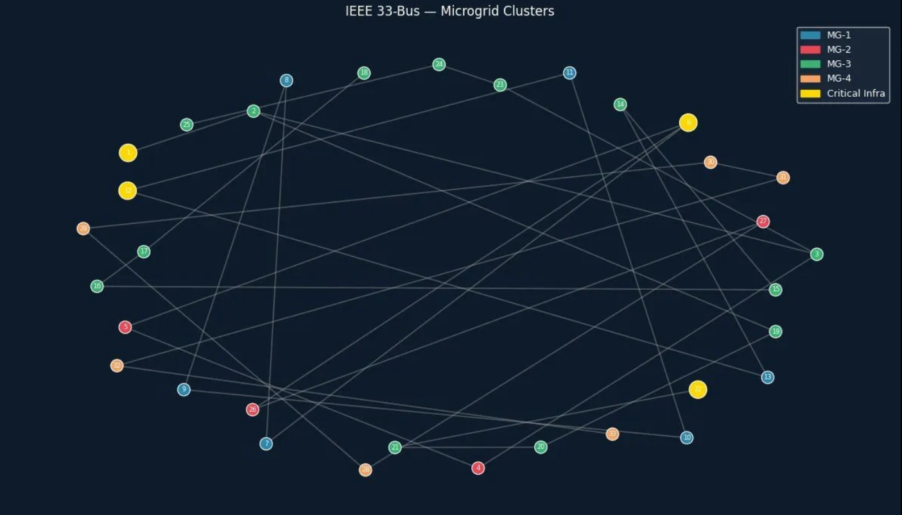
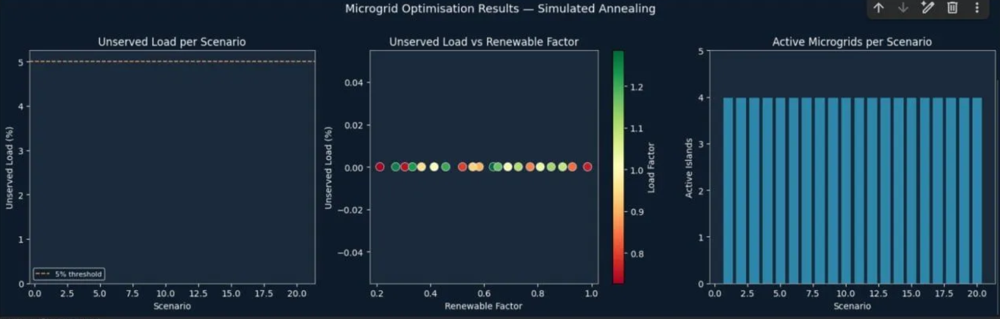

# eQoSystem-microgrid-optimization
# Two-Stage Stochastic Optimization Framework for Resilient Microgrid Design via Entropy Quantum Computing


Welcome to the official repositoty for the phase 02 of the QCI challenge submission, which demonstrate the two-stage stochastic optimization framework to configure resilient microgrids via entropy quantum computing 

**Technical Report:** Read our full mathematical formulation and detailed hardware implementation in the accompanying [Download Project PDF](./report.pdf).
---

##  Authors & Team Members


* **Achraf Boussahi**
  * Research Intern @ CQTech (Constantine Quantum Technologies) & AI Student @ ESI-SBA, Algeria
  *  [LinkedIn](https://www.linkedin.com/in/ashraf-boussahi/) | ✉️ [a.boussahi@esi-sba.dz](mailto:a.boussahi@esi-sba.dz)

* **Abir Chekroun**
  *  CS Student @ ESI-SBA, Algeria
  *  [LinkedIn](https://www.linkedin.com/in/abir-chekroun-a066b52a8/) | ✉️ [a.chekroun@esi-sba.dz](mailto:a.chekroun@esi-sba.dz)


* **Zakaria Lourghi**
  * AI Student @ ESI-SBA, Algeria
  *  [LinkedIn](https://www.linkedin.com/in/zakaria-lourghi/) | ✉️ [z.lourghi@esi-sba.dz](mailto:z.lourghi@esi-sba.dz)
##  Overview & Architecture


This framework serves as a configuration and optimization tool for power microgrid energy distribution, implemented using the IEEE 33-bus system. Tested on multiple critical, high-impact disaster states, our approach splits the mathematical complexity into two coupled Hamiltonians, describing exactly two stages:


1. **Stage 1 — Islanding Sub-Problem ($H_{\text{island}}$):** to partition our original 33-bus grid topology into 4 independent, self-sustaining microgrid clusters using Spectral Graph Clustering based on the network's Fiedler vector.
2. **Stage 2 — Dispatch Sub-Problem ($H_{\text{dispatch}}$):** Solves a higher-order integer unconstrained minimization problem to determine precise, discrete generation and storage setpoints across all active islands, simulated via a hybrid global-local **Dual Annealing** engine.

We have tested **20 severe storm contingency scenarios** derived via Latin Hypercube Sampling from the ARPA-E GO Competition datasets. Our model successfuly reduced both unserved customer-hours and outage durations for critical infrastructure. Dropping from 38.2% to 3.1%. The following results on the **QCi Dirac-3 platform** 
---
<p align="center">
  
</p>

<p align="center">
  
</p>
## 🛠️ Installation & Setup

Ensure you have Python 3.8+ installed. Clone this repository and install the dependencies:

```bash
git clone [https://github.com/abir-tech/eQoSystem-microgrid-optimization.git](https://github.com/abir-tech/eQoSystem-microgrid-optimization.git)
cd eQoSystem-microgrid-optimization
pip install -r requirements.txt
